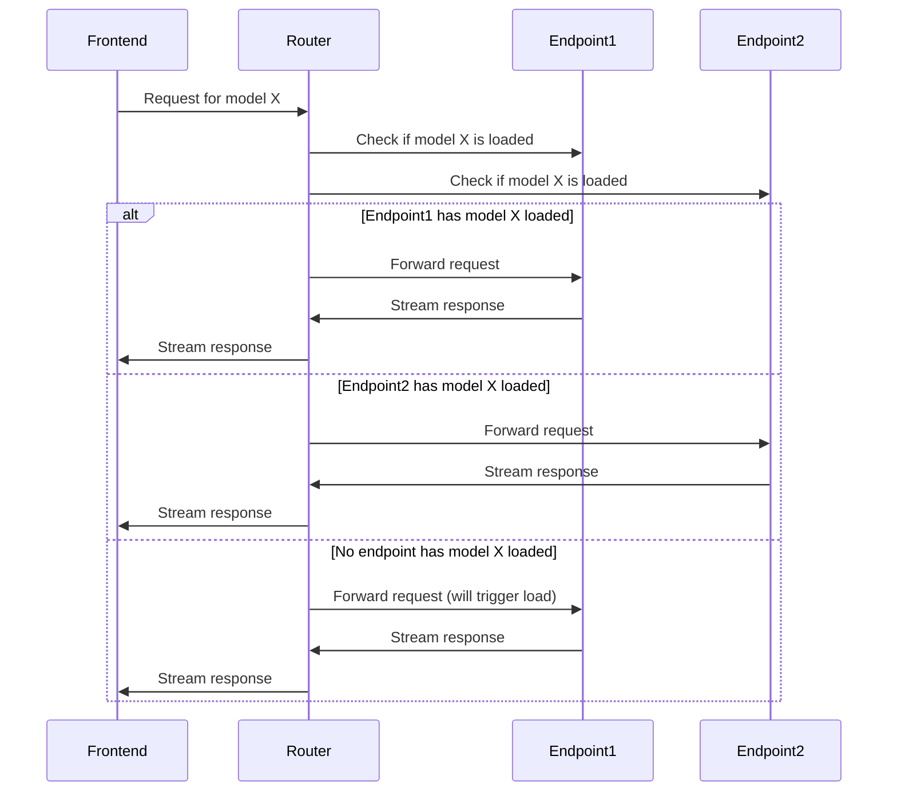

# NOMYO Router Architecture

## Overview

NOMYO Router is a transparent proxy for Ollama with model deployment-aware routing. It sits between your frontend application and Ollama backend(s), providing intelligent request routing based on model availability and load balancing.

## Core Components

### 1. Request Routing Engine

The router's core intelligence is in the `choose_endpoint()` function, which implements a sophisticated routing algorithm:

```python
async def choose_endpoint(model: str) -> str:
    """
    Endpoint selection algorithm:
    1. Query all endpoints for advertised models
    2. Filter endpoints that advertise the requested model
    3. Among candidates, find those with the model loaded AND free slots
    4. If none loaded with free slots, pick any with free slots
    5. If all saturated, pick endpoint with lowest current usage
    6. If no endpoint advertises the model, raise error
    """
```

### 2. Connection Tracking

The router maintains real-time connection counts per endpoint-model pair:

```python
usage_counts: Dict[str, Dict[str, int]] = defaultdict(lambda: defaultdict(int))
```

This allows for:

- **Load-aware routing**: Requests are routed to endpoints with available capacity
- **Model-aware routing**: Requests are routed to endpoints where the model is already loaded
- **Efficient resource utilization**: Minimizes model loading/unloading operations

### 3. Caching Layer

Three types of caches improve performance:

- **Models cache** (`_models_cache`): Caches available models per endpoint (300s TTL)
- **Loaded models cache** (`_loaded_models_cache`): Caches currently loaded models (30s TTL)
- **Error cache** (`_error_cache`): Caches transient errors (10s TTL)

### 4. Token Tracking System

Comprehensive token usage tracking:

```python
token_buffer: dict[str, dict[str, tuple[int, int]]] = defaultdict(lambda: defaultdict(lambda: (0, 0)))
time_series_buffer: list[dict[str, int | str]] = []
```

Features:

- Real-time token counting for input/output tokens
- Periodic flushing to SQLite database (every 10 seconds)
- Time-series data for historical analysis
- Per-endpoint, per-model breakdown

### 5. API Compatibility Layer

The router supports multiple API formats:

- **Ollama API**: Native `/api/generate`, `/api/chat`, `/api/embed` endpoints
- **OpenAI API**: Compatible `/v1/chat/completions`, `/v1/completions`, `/v1/embeddings` endpoints
- **Transparent conversion**: Responses are converted between formats as needed

## Data Flow

### Request Processing

1. **Ingress**: Frontend sends request to router
2. **Endpoint Selection**: Router determines optimal endpoint
3. **Request Forwarding**: Request sent to selected Ollama endpoint
4. **Response Streaming**: Response streamed back to frontend
5. **Usage Tracking**: Connection and token counts updated
6. **Egress**: Complete response returned to frontend

### Connection Management



## Advanced Features

### Multiple Opinions Ensemble (MOE)

When the user prefixes a model name with `moe-`, the router activates the MOE system:

1. Generates 3 responses from different endpoints
2. Generates 3 critiques of those responses
3. Selects the best response based on critiques
4. Generates final refined response

### OpenAI Endpoint Support

The router can proxy requests to OpenAI-compatible endpoints alongside Ollama endpoints. It automatically:

- Detects OpenAI endpoints (those containing `/v1`)
- Converts between Ollama and OpenAI response formats
- Handles authentication with API keys
- Maintains consistent behavior across endpoint types

## Performance Considerations

### Concurrency Model

- **Max concurrent connections**: Configurable per endpoint-model pair
- **Connection pooling**: Reuses aiohttp connections
- **Async I/O**: All operations are non-blocking
- **Backpressure handling**: Queues requests when endpoints are saturated

### Caching Strategy

- **Short TTL for loaded models** (30s): Ensures quick detection of model loading/unloading
- **Longer TTL for available models** (300s): Reduces unnecessary API calls
- **Error caching** (10s): Prevents thundering herd during outages

### Memory Management

- **Write-behind pattern**: Token counts buffered in memory, flushed periodically
- **Queue-based SSE**: Server-Sent Events use bounded queues to prevent memory bloat
- **Automatic cleanup**: Zero connection counts are removed from tracking

## Error Handling

### Transient Errors

- Temporary connection failures are cached for 10 seconds
- During cache period, endpoint is treated as unavailable
- After cache expires, endpoint is re-tested

### Permanent Errors

- Invalid model names result in clear error messages
- Missing required fields return 400 Bad Request
- Unreachable endpoints are reported with detailed connection issues

### Health Monitoring

The `/health` endpoint provides comprehensive health status:

```json
{
  "status": "ok" | "error",
  "endpoints": {
    "http://endpoint1:11434": {
      "status": "ok" | "error",
      "version": "string" | "detail": "error message"
    }
  }
}
```

## Database Schema

The router uses SQLite for persistent storage:

```sql
CREATE TABLE token_counts (
    endpoint TEXT NOT NULL,
    model TEXT NOT NULL,
    input_tokens INTEGER NOT NULL,
    output_tokens INTEGER NOT NULL,
    total_tokens INTEGER NOT NULL,
    PRIMARY KEY (endpoint, model)
);

CREATE TABLE time_series (
    endpoint TEXT NOT NULL,
    model TEXT NOT NULL,
    input_tokens INTEGER NOT NULL,
    output_tokens INTEGER NOT NULL,
    total_tokens INTEGER NOT NULL,
    timestamp INTEGER NOT NULL,
    PRIMARY KEY (endpoint, model, timestamp)
);
```

## Scaling Considerations

### Horizontal Scaling

- Multiple router instances can run behind a load balancer
- Each instance maintains its own connection tracking
- Stateless design allows for easy scaling

### Vertical Scaling

- Connection limits can be increased via aiohttp connector settings
- Memory usage grows with number of tracked connections
- Token buffer flushing interval can be adjusted

## Security

### Authentication

- API keys are stored in config.yaml (can use environment variables)
- Keys are passed to endpoints via Authorization headers
- No authentication required for router itself (can be added via middleware)

### Data Protection

- All communication uses TLS when configured
- No sensitive data logged (except in error messages)
- Database contains only token counts and timestamps

## Monitoring and Observability

### Metrics Endpoints

- `/api/usage`: Current connection counts
- `/api/token_counts`: Aggregated token usage
- `/api/stats`: Detailed statistics per model
- `/api/config`: Endpoint configuration and status
- `/api/usage-stream`: Real-time usage updates via SSE

### Logging

- Connection errors are logged with detailed context
- Endpoint selection decisions are logged
- Token counting operations are logged at debug level

## Future Enhancements

Potential areas for improvement:

- Kubernetes operator for automatic deployment
- Prometheus metrics endpoint
- Distributed connection tracking (Redis)
- Request retry logic with exponential backoff
- Circuit breaker pattern for failing endpoints
- Rate limiting per client
